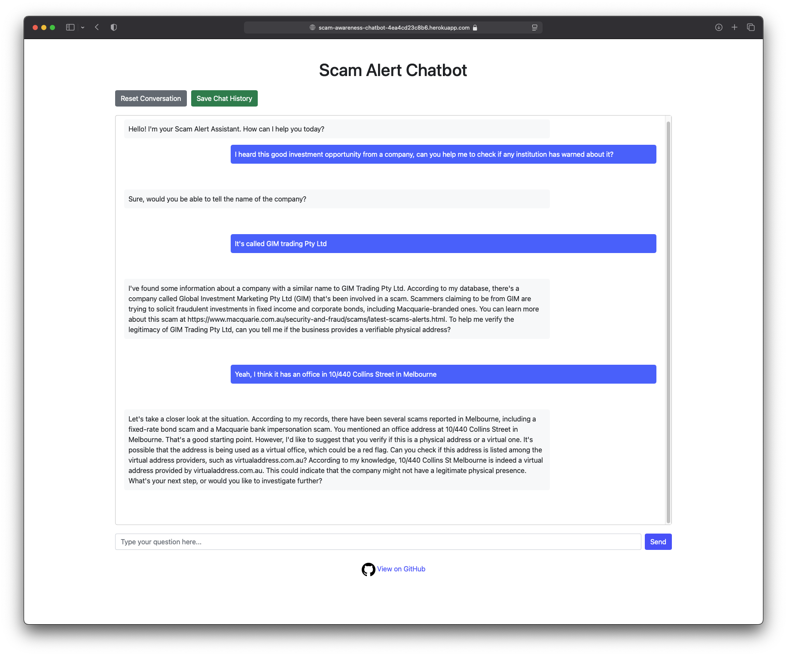

# Scam Alert Chatbot

A RAG-based chatbot that uses Together AI's LLaMA model to provide information about scams based on a database of scam alerts.

## Project Structure

```
.
├── Data/
│   ├── Extra_Scam_Knowledge/  # Additional scam information and resources
│   ├── bank_scam_alert_scrapper.py  # Script to scrape scam alerts
│   ├── embedding.py           # Script to generate embeddings
│   ├── scam_alerts.csv       # Original scam alerts data
│   └── scam_alerts_embeddings.csv  # Generated embeddings
├── templates/                 # HTML templates for the web interface
│   └── index.html            # Chat interface template
├── app.py                    # Main application (Flask + RAG implementation)
├── Procfile                  # Heroku deployment configuration
├── requirements.txt          # Project dependencies
└── README.md                 # This file
```

## Demo

Below is a screenshot of the chatbot interface in action, demonstrating how it provides scam-related information and advice:



## Components

The project consists of several main components:

1. **Web Scraper** (`Data/bank_scam_alert_scrapper.py`):

   - Python script that scrapes scam alerts from bank websites
   - Collects detailed information about various types of scams
   - Saves the scraped data into `scam_alerts.csv`

2. **Embedding Generator** (`Data/embedding.py`):

   - Processes the scam alerts from `scam_alerts.csv`
   - Uses Together AI's m2-bert-80M-2k-retrieval model to generate embeddings
   - Creates `scam_alerts_embeddings.csv` for efficient similarity search in RAG

3. **Intelligent Routing Agent** (`app.py`):

   - Analyzes user queries to determine their intent
   - Uses LLM to detect if a specific company is mentioned
   - Routes company-specific queries to the company information handler
   - Routes general scam pattern queries to the situation analysis handler
   - Ensures appropriate context and prompting for each query type

4. **Boilerplate Response System** (`app.py`):

   - Provides immediate predefined responses for common user queries
   - Improves response time for frequently asked questions
   - Guides users to provide specific information (e.g., company names) when needed

5. **Main Application** (`app.py`):
   - Implements the RAG (Retrieval-Augmented Generation) system
   - Uses embeddings to find relevant scam alerts based on user queries
   - Incorporates additional context from `Extra_Scam_Knowledge/extra_scam_related_knowledge.txt`
   - Combines both RAG results and extra knowledge for comprehensive responses
   - Passes retrieved context to LLaMA 3.3 70B model for generating informed responses
   - Provides a Flask web interface for user interaction

## Setup

1. Install the required dependencies:

```bash
pip install -r requirements.txt
```

2. Set up your Together AI API key:

```bash
export TOGETHER_API_KEY='your_api_key_here'
```

## Usage

1. First, generate embeddings for the scam alerts database:

```bash
python Data/embedding.py
```

2. Start the web application:

```bash
python app.py
```

Then open your browser and navigate to: http://localhost:5000

3. Interact with the chatbot through the web interface.

## Heroku Deployment

1. Make sure you have the [Heroku CLI](https://devcenter.heroku.com/articles/heroku-cli) installed.

2. Login to Heroku:

```bash
heroku login
```

3. Create a new Heroku app:

```bash
heroku create your-app-name
```

4. Set your Together AI API key as a config var:

```bash
heroku config:set TOGETHER_API_KEY='your_api_key_here'
```

5. Deploy to Heroku:

```bash
git push heroku main
```

The application will be available at: https://your-app-name.herokuapp.com

## Features

- **Intelligent Query Routing**:

  - Automatically detects if users are asking about specific companies
  - Routes company queries to specialized handler with company-specific context
  - Routes general scam pattern queries to situation analysis handler
  - Uses LLM-based detection for accurate query classification

- **Boilerplate Response System**:

  - Provides immediate responses for common queries
  - Guides users to provide specific information when needed
  - Reduces response time for frequently asked questions

- **Enhanced User Interface**:

  - Interactive prompt bubbles for common questions
  - Color-coded messages (blue for user, light gray for bot)
  - Conversation history saving functionality
  - Reset conversation option

- **RAG Implementation**:
  - Uses Together AI's m2-bert-80M-2k-retrieval model for embeddings
  - Implements Retrieval-Augmented Generation using LLaMA 3.3 70B
  - Finds the 5 most relevant scam alerts for each query
  - Enhances responses with additional context from curated scam knowledge base
  - Provides context-aware responses based on both the scam database and expert knowledge

## Note

Make sure you have a valid Together AI API key with access to:

- togethercomputer/m2-bert-80M-2k-retrieval (for embeddings)
- meta-llama/Llama-3.3-70B-Instruct-Turbo (for text generation)
